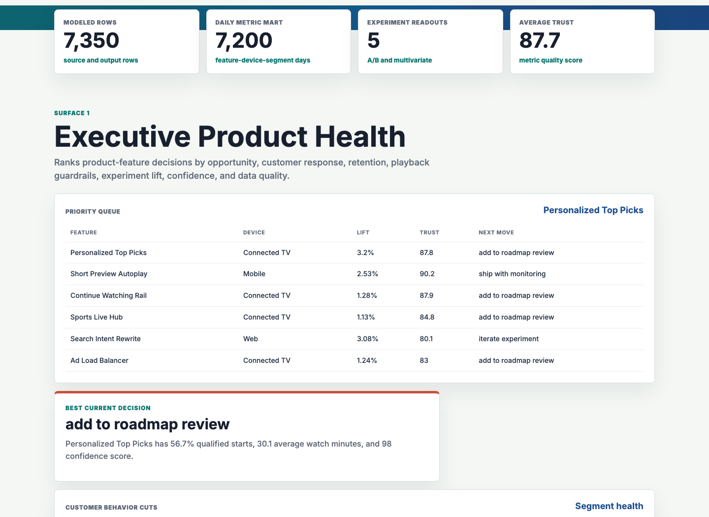
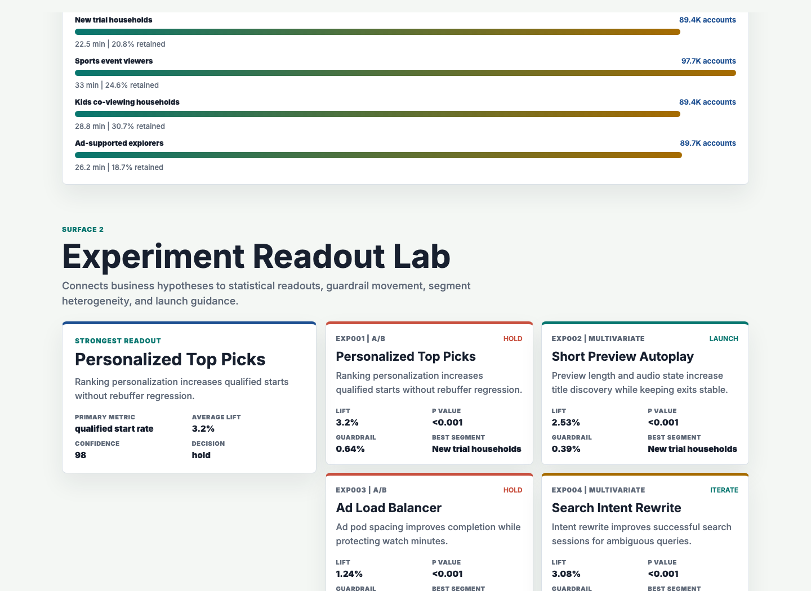
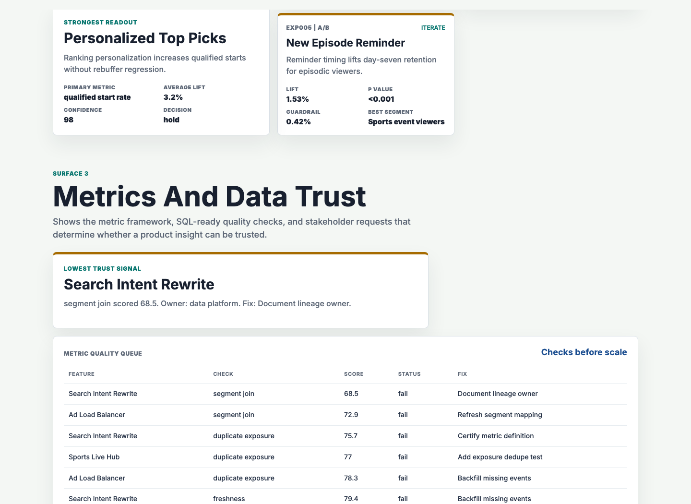

# Streaming Product Analytics Workbench

An interactive portfolio artifact for a product analytics role in digital entertainment. It models how a business intelligence team can evaluate streaming feature performance, customer behavior, experiment impact, device-level guardrails, and metric trust before recommending whether product leaders should ship, iterate, pause, or clean up a feature.

The artifact is built for a multi-device streaming environment where product, engineering, analytics, content, and business stakeholders need a shared weekly view of engagement, conversion, retention, playback quality, experiment results, and data reliability.

## Screenshots



The executive product health surface ranks streaming product features by opportunity, customer response, experiment lift, confidence, playback guardrails, and data quality. It is designed for a product review where leaders need the next action, not just a KPI list.



The experiment readout lab turns A/B and multivariate tests into launch guidance. It shows the hypothesis, primary metric, lift, p-value, guardrail movement, strongest customer segment, and decision for each test.



The metrics and data trust surface shows whether product insights are ready to scale into recurring reporting. It includes metric definitions, quality checks, owners, weak trust signals, and recommended fixes.

## What This Demonstrates

- Translating product and business questions into a structured analytical plan.
- Building a feature, device, service tier, and customer segment metric framework.
- Reading experiment results with primary metrics, guardrails, segment heterogeneity, confidence, and launch recommendations.
- Using SQL-ready data quality checks before insights become product reporting.
- Communicating findings in a format that works for technical analysts and business stakeholders.

## Data

The project uses synthetic data because real feature-level streaming behavior, experiment assignment, and playback telemetry are private. The generator lives in `scripts/generate_streaming_artifact.py` and uses a fixed random seed so the artifact is reproducible.

The synthetic data is modeled on common digital entertainment analytics structures:

- Twelve product features across home, discovery, live, profile, playback, ads, search, social, and notification surfaces.
- Four device families: connected TV, mobile, tablet, and web.
- Two service tiers: subscription and ad-supported.
- Five customer behavior segments: returning binge viewers, new trial households, sports event viewers, kids co-viewing households, and ad-supported explorers.
- 120 days of daily feature, device, and customer-segment metrics with weekend seasonality, live-event pulses, launch-stage variation, playback guardrail changes, and metric quality variation.
- Five A/B or multivariate experiment readouts with control and treatment rows, modeled users, metric successes, watch minutes, playback error rates, and startup latency.
- Metric trust checks for freshness, completeness, duplicate exposure, metric definition, and segment joins.

Generated source tables:

- `data/product_features.csv`
- `data/daily_feature_metrics.csv`
- `data/experiment_results.csv`
- `data/metric_definitions.csv`
- `data/data_quality_checks.csv`
- `data/stakeholder_requests.csv`

Generated analysis outputs:

- `analysis/outputs/product_priority_queue.csv`
- `analysis/outputs/experiment_readouts.csv`
- `analysis/outputs/segment_summary.csv`
- `analysis/outputs/metric_trust_queue.csv`
- `analysis/outputs/summary.json`

## Analysis Logic

The generator calculates:

- Weighted engagement, conversion, retention, playback, and quality metrics by product feature.
- Two-proportion z-test p-values for experiment primary metrics.
- Guardrail deltas for playback error rate and startup latency.
- Segment heterogeneity so the strongest and riskiest customer cuts are visible.
- A product priority score that combines opportunity size, experiment lift, confidence, retention gap, conversion gap, playback risk, and data quality.
- A recommendation state such as ship with monitoring, iterate experiment, add to roadmap review, or fix measurement before decision.

## Role Fit

This artifact is aimed at product performance and customer behavior analytics in a large-scale digital entertainment setting. It demonstrates SQL-shaped thinking, cloud warehouse style tables, metrics frameworks, statistical experimentation, segmentation, ad hoc question handling, and stakeholder-ready communication.

## How To Run

```bash
npm run analyze
npm start
```

Open `http://localhost:4173`.

If port `4173` is already in use, run:

```bash
python3 -m http.server 4174
```

## Scope

This is a portfolio artifact, not a production streaming analytics platform. It does not connect to live customer data, internal event streams, content systems, experimentation platforms, or cloud warehouses. It does show how a product analyst can structure a defensible analytical workflow for feature performance, customer behavior, statistical testing, metric quality, and product recommendations.
